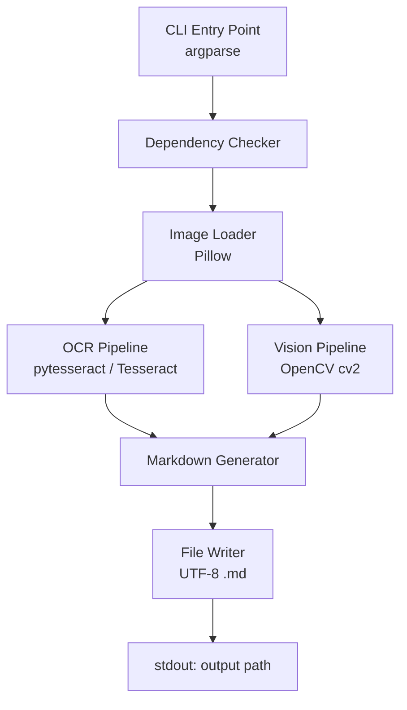

# Design Document: image-to-markdown

## Overview

`image_to_markdown.py` is a single-file Python CLI script that converts an image into a structured Markdown document. It runs two independent local analysis pipelines — Tesseract OCR (via pytesseract) for text extraction and OpenCV (cv2) for visual structure analysis — then combines their outputs into a well-structured `.md` file suitable for consumption by an AI agent.

All processing is local. No network calls are made at any point.

The output file always derives its name from the input image's filename stem (e.g. `diagram.png` → `diagram.md`, `screenshot.jpg` → `screenshot.md`), ensuring that when multiple images are processed in a pipeline each gets its own uniquely named output file.

---

## Architecture



The script is structured as a linear pipeline with two parallel analysis stages (OCR and Vision) that feed a single Markdown generation stage. There are no threads or async operations — the two pipelines run sequentially.

### Module-level structure (single file)

```
image_to_markdown.py
├── check_dependencies()       # fail-fast dependency validation
├── parse_args()               # argparse CLI definition
├── validate_input()           # path existence + extension check
├── derive_output_path()       # stem + .md naming logic
├── load_image()               # Pillow open + metadata extraction
├── run_ocr()                  # pytesseract extraction
├── run_vision()               # OpenCV contour/line/region analysis
├── build_markdown()           # assemble all sections
├── write_output()             # UTF-8 file write + stdout print
└── main()                     # orchestration
```

---

## Components and Interfaces

### 1. Dependency Checker

Called at the very start of `main()` before any argument parsing. Validates:

- `tesseract` binary is on `PATH` (via `shutil.which`)
- `pytesseract` Python package is importable
- `cv2` (opencv-python) Python package is importable
- `PIL` (Pillow) Python package is importable

On any failure, prints a descriptive message to `stderr` with install instructions and calls `sys.exit(1)`.

### 2. CLI (argparse)

```
usage: image_to_markdown.py [-h] [--output OUTPUT] [--lang LANG] image

positional arguments:
  image            Path to the input image file

optional arguments:
  --output OUTPUT  Path for the output .md file (default: derived from image filename)
  --lang LANG      Tesseract language code (default: eng)
  -h, --help       Show this help message and exit
```

### 3. Input Validator

Checks:
- File exists on disk → `sys.exit(1)` + stderr message if not
- Extension is in `{.jpg, .jpeg, .png, .gif, .webp, .tiff, .tif, .bmp}` → `sys.exit(1)` + stderr message if not

### 4. Output Path Deriver

```python
def derive_output_path(image_path: Path, output_arg: str | None) -> Path:
    if output_arg:
        return Path(output_arg)
    return image_path.parent / (image_path.stem + ".md")
```

This is the canonical rule: output filename = `image_path.stem + ".md"` in the same directory as the input, unless `--output` overrides it.

### 5. Image Loader

Uses `PIL.Image.open()` to load the image and extract:
- `filename`: `image_path.name`
- `width`, `height`: from `image.size`
- `file_size`: `image_path.stat().st_size` (bytes)

Returns a `PIL.Image` object and an `ImageMetadata` dataclass.

### 6. OCR Pipeline

```python
def run_ocr(image: PIL.Image, lang: str) -> str:
    return pytesseract.image_to_string(image, lang=lang)
```

Returns the raw extracted text string (may be empty or whitespace-only).

### 7. Vision Pipeline

```python
def run_vision(image_path: Path) -> VisionResult:
    ...
```

Steps:
1. Load image with `cv2.imread()`
2. Convert to grayscale
3. Apply Gaussian blur + Canny edge detection
4. Find contours with `cv2.findContours()`
5. Classify dominant shapes (rectangle via `cv2.approxPolyDP`, circle via aspect ratio + area)
6. Detect lines with `cv2.HoughLinesP()`, classify as horizontal / vertical / diagonal
7. Compute bounding boxes for large contours (area > threshold) as "visual blocks"

Returns a `VisionResult` dataclass.

### 8. Markdown Generator

Assembles the final markdown string from all inputs. Produces the fixed section structure described in the requirements.

### 9. File Writer

Writes the markdown string to the output path with `encoding="utf-8"`, then prints the resolved output path to `stdout`.

---

## Data Models

```python
from dataclasses import dataclass, field
from pathlib import Path

@dataclass
class ImageMetadata:
    filename: str
    width: int
    height: int
    file_size: int       # bytes
    lang: str            # Tesseract language code used

@dataclass
class VisionResult:
    contour_count: int
    dominant_shapes: list[str]   # e.g. ["rectangle", "circle"]
    line_count: int
    line_orientations: list[str] # e.g. ["horizontal", "vertical"]
    region_count: int
    region_positions: list[str]  # e.g. ["top-left", "center"]
    is_empty: bool               # True when no significant structure detected

@dataclass
class AnalysisResult:
    metadata: ImageMetadata
    extracted_text: str          # raw OCR output, may be empty
    vision: VisionResult
```

### Output Markdown Structure

```markdown
# Image: <filename>

## Summary
<one-sentence description: filename, WxH px, text detected / no text detected>

## Extracted Text
<verbatim OCR text, or "_No text was detected in this image._">

## Visual Structure
<OpenCV analysis narrative, or "_No significant visual structure was detected._">

## Metadata
- **Filename:** <filename>
- **File size:** <N> bytes
- **Dimensions:** <W>x<H> px
- **Tesseract language:** <lang>
```

---

## Correctness Properties

*A property is a characteristic or behavior that should hold true across all valid executions of a system — essentially, a formal statement about what the system should do. Properties serve as the bridge between human-readable specifications and machine-verifiable correctness guarantees.*

### Property 1: Invalid path rejection

*For any* string that does not correspond to an existing file on disk, passing it as the image argument SHALL cause the script to exit with a non-zero status code and write a non-empty message to stderr.

**Validates: Requirements 1.2**

---

### Property 2: Invalid extension rejection

*For any* file extension not in the supported set (`{.jpg, .jpeg, .png, .gif, .webp, .tiff, .tif, .bmp}`), passing a path with that extension SHALL cause the script to exit with a non-zero status code and write a non-empty message to stderr.

**Validates: Requirements 1.3**

---

### Property 3: Output path derives from input filename stem

*For any* valid image path and no `--output` argument, the output file path produced by `derive_output_path()` SHALL equal `image_path.parent / (image_path.stem + ".md")`. In particular, the output filename stem SHALL equal the input filename stem.

**Validates: Requirements 1.5**

---

### Property 4: Output markdown contains all required sections

*For any* valid image processed by the script, the resulting markdown string SHALL contain all five required sections in order: `# Image: <filename>`, `## Summary`, `## Extracted Text`, `## Visual Structure`, and `## Metadata`. The `## Metadata` section SHALL include the filename, file size, dimensions, and Tesseract language.

**Validates: Requirements 3.1, 3.2, 3.3, 3.4, 3.5**

---

### Property 5: Output file is valid UTF-8

*For any* valid image processed by the script, the bytes written to the output `.md` file SHALL be decodable as UTF-8 without error.

**Validates: Requirements 3.6**

---

### Property 6: Visual analysis content reflects detected features

*For any* image in which OpenCV detects at least one contour, line, or bounding region, the `## Visual Structure` section of the output markdown SHALL contain a numeric count of the detected feature(s) and a description of their type or orientation.

**Validates: Requirements 4.4, 4.5, 4.6**

---

### Property 7: Successful run prints output path to stdout

*For any* valid image and argument combination that results in a successful run, the script SHALL print the resolved output file path to stdout.

**Validates: Requirements 5.2**

---

### Property 8: Output is valid Markdown

*For any* valid image processed by the script, the resulting `.md` file SHALL be parseable by a standard Markdown parser (e.g. `mistune` or `markdown-it-py`) without raising a parse error.

**Validates: Requirements 6.1**

---

### Property 9: Deterministic output (idempotence)

*For any* valid image and identical argument set, running the script twice SHALL produce byte-for-byte identical output files.

**Validates: Requirements 6.2**

---

## Error Handling

| Condition | Exit code | Output |
|---|---|---|
| Missing positional `image` argument | 2 (argparse default) | stderr: argparse usage message |
| Image file does not exist | 1 | stderr: "Error: File not found: <path>" |
| Unsupported file extension | 1 | stderr: "Error: Unsupported file type '<ext>'. Supported: jpg, jpeg, png, gif, webp, tiff, tif, bmp" |
| `tesseract` binary not on PATH | 1 | stderr: "Error: Tesseract not found. Install from https://github.com/tesseract-ocr/tesseract" |
| `pytesseract` not importable | 1 | stderr: "Error: pytesseract not installed. Run: pip install pytesseract" |
| `cv2` not importable | 1 | stderr: "Error: opencv-python not installed. Run: pip install opencv-python" |
| `PIL` not importable | 1 | stderr: "Error: Pillow not installed. Run: pip install Pillow" |
| OCR returns empty / whitespace | 0 | Markdown with note in `## Extracted Text` |
| OpenCV finds no structure | 0 | Markdown with note in `## Visual Structure` |
| Output file not writable | 1 | stderr: "Error: Cannot write to <path>: <OS error>" |

All error messages are written to `stderr`. Normal output (the output file path) is written to `stdout`.

---

## Testing Strategy

### Dual Testing Approach

Both unit tests and property-based tests are required. They are complementary:

- **Unit tests** cover specific examples, integration points, and error conditions.
- **Property tests** verify universal invariants across randomly generated inputs.

### Unit Tests (pytest)

- `test_derive_output_path`: verify stem-based naming for several concrete filenames
- `test_validate_input_missing_file`: verify exit(1) + stderr for a non-existent path
- `test_validate_input_bad_extension`: verify exit(1) + stderr for `.pdf`, `.docx`, etc.
- `test_dependency_check_missing_tesseract`: mock `shutil.which` returning `None`, verify exit(1)
- `test_dependency_check_missing_pytesseract`: mock import failure, verify exit(1)
- `test_dependency_check_missing_cv2`: mock import failure, verify exit(1)
- `test_run_ocr_with_text_image`: use a small synthetic PIL image with known text, verify non-empty result
- `test_run_ocr_blank_image`: blank white image → empty string returned
- `test_run_vision_with_shapes`: synthetic image with rectangles → VisionResult has contour_count > 0
- `test_run_vision_blank_image`: blank image → VisionResult.is_empty == True
- `test_build_markdown_all_sections`: verify all five section headings present in output
- `test_build_markdown_no_text`: verify "no text was detected" note appears
- `test_build_markdown_no_vision`: verify "no significant visual structure" note appears
- `test_help_flag`: invoke with `--help`, verify exit(0) and usage in stdout
- `test_lang_default`: run without `--lang`, verify pytesseract called with `lang="eng"`
- `test_lang_override`: run with `--lang fra`, verify pytesseract called with `lang="fra"`
- `test_stdout_output_path`: verify stdout contains the output path on success

### Property-Based Tests (Hypothesis)

Minimum 100 iterations per property. Each test is tagged with a comment referencing the design property.

```python
# Feature: image-to-markdown, Property 1: Invalid path rejection
@given(st.text(min_size=1).filter(lambda s: not Path(s).exists()))
@settings(max_examples=100)
def test_invalid_path_exits_nonzero(path_str): ...

# Feature: image-to-markdown, Property 2: Invalid extension rejection
@given(st.text(alphabet=st.characters(whitelist_categories=("Ll",)), min_size=1)
       .filter(lambda e: "." + e not in SUPPORTED_EXTENSIONS))
@settings(max_examples=100)
def test_invalid_extension_exits_nonzero(ext): ...

# Feature: image-to-markdown, Property 3: Output path derives from input filename stem
@given(st.from_regex(r'[a-zA-Z0-9_\-]+', fullmatch=True),
       st.sampled_from(list(SUPPORTED_EXTENSIONS)))
@settings(max_examples=100)
def test_output_path_stem_matches_input(stem, ext): ...

# Feature: image-to-markdown, Property 4: Output markdown contains all required sections
@given(image_strategy())   # custom Hypothesis strategy generating synthetic PIL images
@settings(max_examples=100)
def test_output_contains_all_sections(image): ...

# Feature: image-to-markdown, Property 5: Output file is valid UTF-8
@given(image_strategy())
@settings(max_examples=100)
def test_output_is_valid_utf8(image): ...

# Feature: image-to-markdown, Property 6: Visual analysis content reflects detected features
@given(image_with_shapes_strategy())  # generates images guaranteed to have contours
@settings(max_examples=100)
def test_visual_analysis_contains_counts(image): ...

# Feature: image-to-markdown, Property 7: Successful run prints output path to stdout
@given(image_strategy())
@settings(max_examples=100)
def test_stdout_contains_output_path(image): ...

# Feature: image-to-markdown, Property 8: Output is valid Markdown
@given(image_strategy())
@settings(max_examples=100)
def test_output_is_valid_markdown(image): ...

# Feature: image-to-markdown, Property 9: Deterministic output
@given(image_strategy())
@settings(max_examples=100)
def test_output_is_deterministic(image): ...
```

**Property-based testing library**: [Hypothesis](https://hypothesis.readthedocs.io/) (`pip install hypothesis`)

Each property-based test MUST be implemented as a single test function. The `image_strategy()` helper generates small synthetic PIL images (e.g. 64×64 px, random pixel values) saved to a temporary file, covering blank, text-like, and shape-containing images. The `image_with_shapes_strategy()` generates images with programmatically drawn rectangles/circles to guarantee detectable contours.
